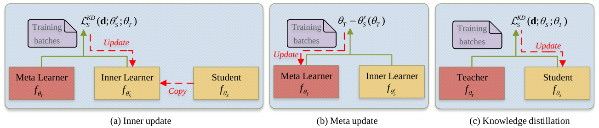
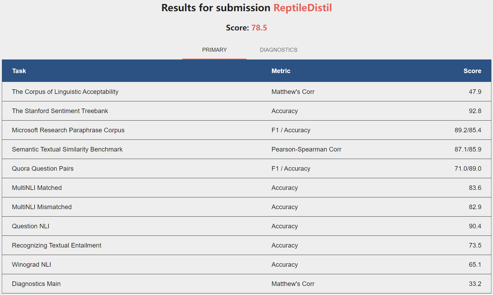

# ReptileDistil

This repository contains an implementation with PyTorch for the paper "Knowledge Distillation with Reptile Meta-Learning for Pretrained Language Model Compression". The figure below illustrates an overview of the proposed knowledge distillation framework of ReptileDistil.



For more details about the technical details of ReptileDistil, please refer to our paper.

**Installation**

Run command below to install the environment (using python3):

```
pip install -r requirements.txt
```

**Data Preparation**

Run command below to get GLUE data:

```
python download_glue_data.py --data_dir glue_data --task all
```

**Student Initialization**

Download the 6-layer [general TinyBERT](https://huggingface.co/huawei-noah/TinyBERT_General_6L_768D) model as the initial student model, and unzip it to directory `./tinybert/TinyBERT_General_6L_768D`

**Fine-tuning**

Run command below to get fine-tuned teacher model for every task of GLUE:

```
# WNLI
python run_glue.py \
  --model_type bert \
  --model_name_or_path bert-base-uncased \
  --task_name WNLI \
  --data_dir ./glue_data/WNLI/ \
  --do_lower_case \
  --max_seq_length 128 \
  --do_train \
  --per_gpu_train_batch_size 32 \
  --per_gpu_eval_batch_size 32 \
  --learning_rate 5e-5 \
  --num_train_epochs 5 \
  --output_dir ./model/WNLI/teacher/ \
  --overwrite_output_dir
  
# RTE
python run_glue.py \
  --model_type bert \
  --model_name_or_path bert-base-uncased \
  --task_name RTE \
  --data_dir ./glue_data/RTE/ \
  --do_lower_case \
  --max_seq_length 128 \
  --do_train \
  --per_gpu_train_batch_size 32 \
  --per_gpu_eval_batch_size 32 \
  --learning_rate 5e-5 \
  --num_train_epochs 5 \
  --output_dir ./model/RTE/teacher/ \
  --overwrite_output_dir

# MRPC
python run_glue.py \
  --model_type bert \
  --model_name_or_path bert-base-uncased \
  --task_name MRPC \
  --data_dir ./glue_data/MRPC/ \
  --do_lower_case \
  --max_seq_length 128 \
  --do_train \
  --per_gpu_train_batch_size 32 \
  --per_gpu_eval_batch_size 32 \
  --learning_rate 5e-5 \
  --num_train_epochs 5 \
  --output_dir ./model/MRPC/teacher/ \
  --overwrite_output_dir

# STS-B
python run_glue.py \
  --model_type bert \
  --model_name_or_path bert-base-uncased \
  --task_name STS-B \
  --data_dir ./glue_data/STS-B/ \
  --do_lower_case \
  --max_seq_length 128 \
  --do_train \
  --per_gpu_train_batch_size 32 \
  --per_gpu_eval_batch_size 32 \
  --learning_rate 5e-5 \
  --num_train_epochs 5 \
  --output_dir ./model/STS-B/teacher/ \
  --overwrite_output_dir

# CoLA
python run_glue.py \
  --model_type bert \
  --model_name_or_path bert-base-uncased \
  --task_name CoLA \
  --data_dir ./glue_data/CoLA/ \
  --do_lower_case \
  --max_seq_length 128 \
  --do_train \
  --per_gpu_train_batch_size 32 \
  --per_gpu_eval_batch_size 32 \
  --learning_rate 5e-5 \
  --num_train_epochs 5 \
  --output_dir ./model/CoLA/teacher/ \
  --overwrite_output_dir

# SST-2
python run_glue.py \
  --model_type bert \
  --model_name_or_path bert-base-uncased \
  --task_name SST-2 \
  --data_dir ./glue_data/SST-2/ \
  --do_lower_case \
  --max_seq_length 128 \
  --do_train \
  --per_gpu_train_batch_size 32 \
  --per_gpu_eval_batch_size 32 \
  --learning_rate 5e-5 \
  --num_train_epochs 5 \
  --output_dir ./model/SST-2/teacher/ \
  --overwrite_output_dir

# QNLI
python run_glue.py \
  --model_type bert \
  --model_name_or_path bert-base-uncased \
  --task_name QNLI \
  --data_dir ./glue_data/QNLI/ \
  --do_lower_case \
  --max_seq_length 128 \
  --do_train \
  --per_gpu_train_batch_size 32 \
  --per_gpu_eval_batch_size 32 \
  --learning_rate 5e-5 \
  --num_train_epochs 5 \
  --output_dir ./model/QNLI/teacher/ \
  --overwrite_output_dir

# QQP
python run_glue.py \
  --model_type bert \
  --model_name_or_path bert-base-uncased \
  --task_name QQP \
  --data_dir ./glue_data/QQP/ \
  --do_lower_case \
  --max_seq_length 128 \
  --do_train \
  --per_gpu_train_batch_size 32 \
  --per_gpu_eval_batch_size 32 \
  --learning_rate 5e-5 \
  --num_train_epochs 5 \
  --output_dir ./model/QQP/teacher/ \
  --overwrite_output_dir

# MNLI
python run_glue.py \
  --model_type bert \
  --model_name_or_path bert-base-uncased \
  --task_name MNLI \
  --data_dir ./glue_data/MNLI/ \
  --do_lower_case \
  --max_seq_length 128 \
  --do_train \
  --per_gpu_train_batch_size 32 \
  --per_gpu_eval_batch_size 32 \
  --learning_rate 5e-5 \
  --num_train_epochs 5 \
  --output_dir ./model/MNLI/teacher/ \
  --overwrite_output_dir
```

**Distillation**

Run command below to get distilled student model for every task of GLUE:

```
# WNLI
python run_glue_with_reptile.py \
  --model_type bert \
  --teacher_model ./model/WNLI/teacher/ \
  --student_model ./tinybert/TinyBERT_General_6L_768D/ \
  --task_name WNLI \
  --data_dir ./glue_data/WNLI/ \
  --do_lower_case \
  --max_seq_length 128 \
  --do_train \
  --per_gpu_train_batch_size 32 \
  --per_gpu_eval_batch_size 32 \
  --teacher_learning_rate 5e-5 \
  --student_learning_rate 5e-5 \
  --num_train_epochs 5 \
  --output_dir ./model/WNLI/student/ \
  --overwrite_output_dir \
  --alpha 0.5 \
  --num_hidden_layers 6 \
  --temperature 5.0 \
  --strategy skip

# RTE
python run_glue_with_reptile.py \
  --model_type bert \
  --teacher_model ./model/RTE/teacher/ \
  --student_model ./tinybert/TinyBERT_General_6L_768D/ \
  --task_name RTE \
  --data_dir ./glue_data/RTE/ \
  --do_lower_case \
  --max_seq_length 128 \
  --do_train \
  --per_gpu_train_batch_size 32 \
  --per_gpu_eval_batch_size 32 \
  --teacher_learning_rate 5e-5 \
  --student_learning_rate 5e-5 \
  --num_train_epochs 5 \
  --output_dir ./model/RTE/student/ \
  --overwrite_output_dir \
  --alpha 0.5 \
  --num_hidden_layers 6 \
  --temperature 5.0 \
  --strategy skip

# MRPC
python run_glue_with_reptile.py \
  --model_type bert \
  --teacher_model ./model/MRPC/teacher/ \
  --student_model ./tinybert/TinyBERT_General_6L_768D/ \
  --task_name MRPC \
  --data_dir ./glue_data/MRPC/ \
  --do_lower_case \
  --max_seq_length 128 \
  --do_train \
  --per_gpu_train_batch_size 32 \
  --per_gpu_eval_batch_size 32 \
  --teacher_learning_rate 5e-5 \
  --student_learning_rate 5e-5 \
  --num_train_epochs 5 \
  --output_dir ./model/MRPC/student/ \
  --overwrite_output_dir \
  --alpha 0.5 \
  --num_hidden_layers 6 \
  --temperature 5.0 \
  --strategy skip

# STS-B
python run_glue_with_reptile.py \
  --model_type bert \
  --teacher_model ./model/STS-B/teacher/ \
  --student_model ./tinybert/TinyBERT_General_6L_768D/ \
  --task_name STS-B \
  --data_dir ./glue_data/STS-B/ \
  --do_lower_case \
  --max_seq_length 128 \
  --do_train \
  --per_gpu_train_batch_size 32 \
  --per_gpu_eval_batch_size 32 \
  --teacher_learning_rate 5e-5 \
  --student_learning_rate 5e-5 \
  --num_train_epochs 5 \
  --output_dir ./model/STS-B/student/ \
  --overwrite_output_dir \
  --alpha 0.5 \
  --num_hidden_layers 6 \
  --temperature 5.0 \
  --strategy skip

# CoLA
python run_glue_with_reptile.py \
  --model_type bert \
  --teacher_model ./model/CoLA/teacher/ \
  --student_model ./tinybert/TinyBERT_General_6L_768D/ \
  --task_name CoLA \
  --data_dir ./glue_data/CoLA/ \
  --do_lower_case \
  --max_seq_length 128 \
  --do_train \
  --per_gpu_train_batch_size 32 \
  --per_gpu_eval_batch_size 32 \
  --teacher_learning_rate 5e-5 \
  --student_learning_rate 5e-5 \
  --num_train_epochs 5 \
  --output_dir ./model/CoLA/student/ \
  --overwrite_output_dir \
  --alpha 0.5 \
  --num_hidden_layers 6 \
  --temperature 5.0 \
  --strategy skip

# SST-2
python run_glue_with_reptile.py \
  --model_type bert \
  --teacher_model ./model/SST-2/teacher/ \
  --student_model ./tinybert/TinyBERT_General_6L_768D/ \
  --task_name SST-2 \
  --data_dir ./glue_data/SST-2/ \
  --do_lower_case \
  --max_seq_length 128 \
  --do_train \
  --per_gpu_train_batch_size 32 \
  --per_gpu_eval_batch_size 32 \
  --teacher_learning_rate 5e-5 \
  --student_learning_rate 5e-5 \
  --num_train_epochs 5 \
  --output_dir ./model/SST-2/student/ \
  --overwrite_output_dir \
  --alpha 0.5 \
  --num_hidden_layers 6 \
  --temperature 5.0 \
  --strategy skip

# QNLI
python run_glue_with_reptile.py \
  --model_type bert \
  --teacher_model ./model/QNLI/teacher/ \
  --student_model ./tinybert/TinyBERT_General_6L_768D/ \
  --task_name QNLI \
  --data_dir ./glue_data/QNLI/ \
  --do_lower_case \
  --max_seq_length 128 \
  --do_train \
  --per_gpu_train_batch_size 32 \
  --per_gpu_eval_batch_size 32 \
  --teacher_learning_rate 5e-5 \
  --student_learning_rate 5e-5 \
  --num_train_epochs 5 \
  --output_dir ./model/QNLI/student/ \
  --overwrite_output_dir \
  --alpha 0.5 \
  --num_hidden_layers 6 \
  --temperature 5.0 \
  --strategy skip

# QQP
python run_glue_with_reptile.py \
  --model_type bert \
  --teacher_model ./model/QQP/teacher/ \
  --student_model ./tinybert/TinyBERT_General_6L_768D/ \
  --task_name QQP \
  --data_dir ./glue_data/QQP/ \
  --do_lower_case \
  --max_seq_length 128 \
  --do_train \
  --per_gpu_train_batch_size 32 \
  --per_gpu_eval_batch_size 32 \
  --teacher_learning_rate 5e-5 \
  --student_learning_rate 5e-5 \
  --num_train_epochs 5 \
  --output_dir ./model/QQP/student/ \
  --overwrite_output_dir \
  --alpha 0.5 \
  --num_hidden_layers 6 \
  --temperature 5.0 \
  --strategy skip

# MNLI
python run_glue_with_reptile.py \
  --model_type bert \
  --teacher_model ./model/MNLI/teacher/ \
  --student_model ./tinybert/TinyBERT_General_6L_768D/ \
  --task_name MNLI \
  --data_dir ./glue_data/MNLI/ \
  --do_lower_case \
  --max_seq_length 128 \
  --do_train \
  --per_gpu_train_batch_size 32 \
  --per_gpu_eval_batch_size 32 \
  --teacher_learning_rate 5e-5 \
  --student_learning_rate 5e-5 \
  --num_train_epochs 5 \
  --output_dir ./model/MNLI/student/ \
  --overwrite_output_dir \
  --alpha 0.5 \
  --num_hidden_layers 6 \
  --temperature 5.0 \
  --strategy skip
```

**Prediction**

Run command below to get predictions of the distilled student model for every task of GLUE:

```
# WNLI
python run_glue.py \
  --model_type bert \
  --model_name_or_path ./model/WNLI/student/ \
  --task_name WNLI \
  --data_dir ./glue_data/WNLI/ \
  --do_lower_case \
  --max_seq_length 128 \
  --do_test \
  --per_gpu_eval_batch_size 32 \
  --output_dir ./result/ 

# RTE
python run_glue.py \
  --model_type bert \
  --model_name_or_path ./model/RTE/student/ \
  --task_name RTE \
  --data_dir ./glue_data/RTE/ \
  --do_lower_case \
  --max_seq_length 128 \
  --do_test \
  --per_gpu_eval_batch_size 32 \
  --output_dir ./result/ 

# MRPC
python run_glue.py \
  --model_type bert \
  --model_name_or_path ./model/MRPC/student/ \
  --task_name MRPC \
  --data_dir ./glue_data/MRPC/ \
  --do_lower_case \
  --max_seq_length 128 \
  --do_test \
  --per_gpu_eval_batch_size 32 \
  --output_dir ./result/ 

# STS-B
python run_glue.py \
  --model_type bert \
  --model_name_or_path ./model/STS-B/student/ \
  --task_name STS-B \
  --data_dir ./glue_data/STS-B/ \
  --do_lower_case \
  --max_seq_length 128 \
  --do_predict \
  --per_gpu_eval_batch_size 32 \
  --output_dir ./result/ 

# CoLA
python run_glue.py \
  --model_type bert \
  --model_name_or_path ./model/CoLA/student/ \
  --task_name CoLA \
  --data_dir ./glue_data/CoLA/ \
  --do_lower_case \
  --max_seq_length 128 \
  --do_test \
  --per_gpu_eval_batch_size 32 \
  --output_dir ./result/ 

# SST-2
python run_glue.py \
  --model_type bert \
  --model_name_or_path ./model/SST-2/student/ \
  --task_name SST-2 \
  --data_dir ./glue_data/SST-2/ \
  --do_lower_case \
  --max_seq_length 128 \
  --do_test \
  --per_gpu_eval_batch_size 32 \
  --output_dir ./result/ 

# QNLI
python run_glue.py \
  --model_type bert \
  --model_name_or_path ./model/QNLI/student/ \
  --task_name QNLI \
  --data_dir ./glue_data/QNLI/ \
  --do_lower_case \
  --max_seq_length 128 \
  --do_predict \
  --per_gpu_eval_batch_size 32 \
  --output_dir ./result/ 

# QQP
python run_glue.py \
  --model_type bert \
  --model_name_or_path ./model/QQP/student/ \
  --task_name QQP \
  --data_dir ./glue_data/QQP/ \
  --do_lower_case \
  --max_seq_length 128 \
  --do_test \
  --per_gpu_eval_batch_size 32 \
  --output_dir ./result/ 

# MNLI
python run_glue.py \
  --model_type bert \
  --model_name_or_path ./model/MNLI/student/ \
  --task_name MNLI \
  --data_dir ./glue_data/MNLI/ \
  --do_lower_case \
  --max_seq_length 128 \
  --do_test \
  --per_gpu_eval_batch_size 32 \
  --output_dir ./result/

# AX
python run_ax.py \
  --model_type bert \
  --model_name_or_path ./model/MNLI/student/ \
  --task_name AX \
  --data_dir ./glue_data/diagnostic/ \
  --do_lower_case \
  --max_seq_length 128 \
  --do_test \
  --per_gpu_eval_batch_size 32 \
  --output_dir ./result/
```

**Results**

On the GLUE development set:

|     Model     | #Param | Speed-up |  CoLA | SST-2 |    MRPC   |   STS-B   |    QQP    |    MNLI   |  QNLI |  RTE  |
| :-----------: | :----: | :-----: | :---: | :---: | :-------: | :-------: | :-------: | :-------: | :---: | :---: |
| ReptileDistil |  66M   |  &nbsp;&nbsp;&nbsp;&nbsp;1.94×&nbsp;&nbsp;&nbsp;&nbsp;  |  54.8 | &nbsp;92.2&nbsp;&nbsp; | 91.6/87.7 | 89.5/89.3 | 87.6/90.1 | 83.7/83.7 |  90.5 |  75.3 |

On the GLUE test set:




